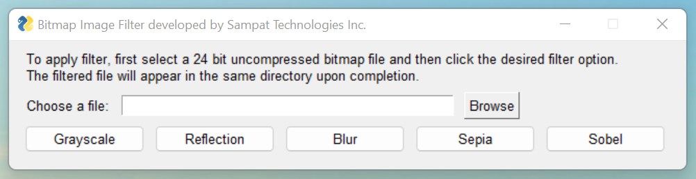

# Bitmap Filter
### Bitmap Filter is a tool that allows users to apply 5 different filtering options to an uncompressed 24 bit bitmap file.
    
    Filter Options:
        1. Grayscale: offers a timeless look by translating pixels into its black, white and gray representation
        2. Reflection: reflect images along horizontal axis
        3. Blur: provides a slight blur to soften the image
        4. Sepia: creates a vintage look with warm brownish tones
        5. Sobel: identifies edges using a 2D spatial gradient measurement


## Screenshots


Original 24 Bit Bitmap Image:

Grayscale:

Reflection:

Blur:

Sepia:

Sobel:


## Deployment

To deploy this tool run

```bash
  python bitmapfilter.py 
```
